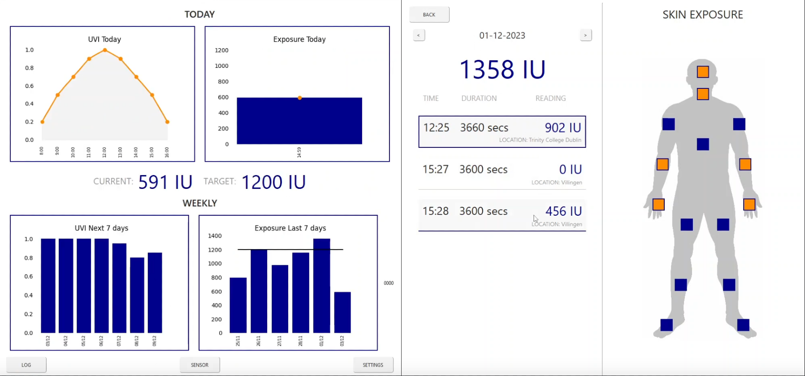
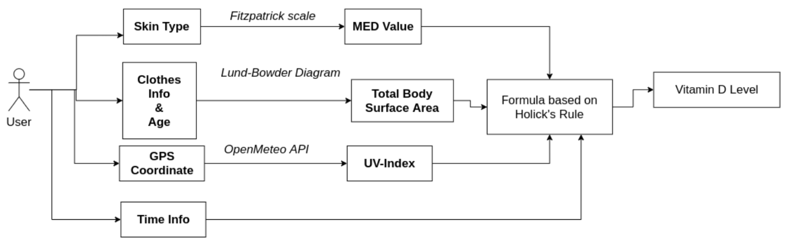
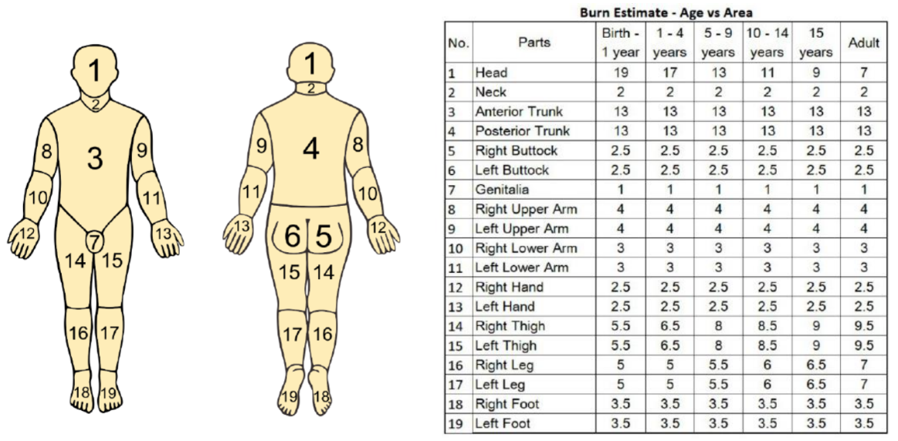

# DSURE - VITAMIN-D Tracker

## Table of Contents:
1. [INTRODUCTION](#introduction)
2. [HOLICK’S RULE AND IMPLEMENTATION](#holicks-rule-and-implementation)
    - [UV dose](#uv-dose)
    - [Minimal Erythema Dose (MED)](#minimal-erythema-dose-med)
    - [Body Surface Area (BSA)](#body-surface-area-bsa)
3. [CALCULATIONS](#calculations)
    - [CALCULATING UV-INDEX](#calculating-uv-index)
    - [CALCULATING BODY SURFACE AREA](#calculating-body-surface-area)
    - [CALCULATING MINIMUM ERYTHEMA DOSE (MED)](#calculating-minimum-erythema-dose-med)
4. [HOW TO USE THE APPLICATION](#how-to-use-the-application)
5. [REFERENCES](#references)

## INTRODUCTION
Over the past few years, there has been a sudden increase in Vitamin D deficiencies among adults of all age groups. This 
is most prevalent in adults who choose to spend most of their time indoors. The reasons for this sedentary lifestyle can 
be attributed to work from home culture or just general lack of motivation to go out. Naturally, these individuals are more 
susceptible to Vitamin D deficiencies which often results in serious ailments like Osteoporosis and Multiple Sclerosis. I 
serve as a personal example since my Vitamin D levels dropped critically low due to staying indoors for an extended period 
during Covid Lockdown.

To determine Vitamin D production, I used a practical implementation of Holicks Rule. This involved combining UV-Index 
with total time spent in sunlight, body surface area exposed and skin color of the person.

## HOLICK’S RULE AND IMPLEMENTATION
All of the functions and knowledge in this section are based on two research papers mentioned in references.
Our body produces two types of Vitamin D when it comes in contact with sunlight: These include Vitamin D3 
(cholecalciferol) and Vitamin D2 (ergocalciferol) out of which former is most useful and effective in maintaining good 
health.
Here’s a summary of factors impacting Vitamin D3 generation in our body:
- Vitamin D3 is generated naturally in our skin when Ultraviolet-B (UVB) light hits it.
- Production is inversely impacted due to the presence of clothes or sunscreen.
- Melanin also limits the production of Vitamin D3. Hence, people with darker complexions have reduced 
production and are more susceptible to deficiencies.
- The concentration of UVB is highest around noon during the months of April to October.
- Being closer to poles, countries like Ireland receive sunlight at higher angles which result in further reduction of 
UVB due to scattering.

***Holick’s rule says that sun exposure 1/4 of a minimal erythemal dose (MED) over 1/4 of a body is equivalent to 1000 
International Units (IU) oral vitamin D3.***


***Figure: Summary of Fusion Algorithm to obtain Vitamin D levels***

We can organize above using Holicks Rule states as a function to predict Vitamin D3 production:
1. **UV dose:** which depends on geographical location, time of day, month and weather
2. **Minimal Erythema Dose (MED):** minimum energy density required for a first-degree sunburn which depends on 
the skin color of a person.
3. **Body Surface Area (BSA):** how much percentage of body is exposed to sunlight.

This function is given as:

$$  
X = 21120 \cdot \frac{UVI \cdot t \cdot BSA  }{k \cdot MED}
$$

Where **X** is total Vitamin D produced in IU, **21120** is a correction factor, **UVI** is the UV-Index value in the region, **t** is total 
time spent in sunlight in seconds, **k** is a constant and **MED** is Minimal Erythema Dose based on skin color of the person.

The following data is obtained from multiple sources such as Location API, OpenMeteo weather API, or just directly asking 
the user.

### CALCULATIONS

#### 1. CALCULATING UV-INDEX
To begin, user is asked about his geographical location which is converted into GPS coordinates.
Then public API provided by OpenMeteo to get UV-Index forecasts for 7 days at those GPS coordinates. These include:
- Maximum UV-Index for the day
- Maximum UV-Index with clear sky
Since UV-Index starts increasing from morning, peaks at noon and then gradually decreases till evening. I extrapolate the 
readings between 8 AM and 4 PM.

#### 2. CALCULATING BODY SURFACE AREA
The user is presented with a simple UI to determine which body parts are exposed to sunlight. This UI is based on the Lund 
Browder diagram which is the standard to model skin surface. It also takes the age of the person in account.


***Figure: Lund Browder diagram to determine percentage of body area per body part.***

#### 3. CALCULATING MINIMUM ERYTHEMA DOSE (MED)
To determine MED, we ask users to classify their skin colors in 6 categories. The MED value is mapped to each category.

| CATEGORY | SKIN                   TYPE | MED  VALUE |
|----------|-----------------------------|------------|
| I        | Pale            skin        | 200        |
| II       | Light  skin                 | 250        |
| III      | Creamy white skin           | 300        |
| IV       | Olive skin                  | 450        |
| V        | Dark-brow skin              | 600        |
| VI       | Deeply pigmented skin       | 1000       |

***Figure: MED value mappings to Skin category***

## HOW TO USE THE APPLICATION
1. Setup a virtual environment
    ```
    python3 -m venv env
    ```
2. Load environment
   ```
   source env/bin/activate
   ```
3. Install dependencies
    ```
    pip install -r pip.list
    ```
4. Run app.py to start the application

## REFERENCES
- Holick's rule: https://www.sciencedirect.com/science/article/pii/S0960076010001925?via%3Dihub
- Holick's rule calc: https://ieeexplore.ieee.org/stamp/stamp.jsp?tp=&arnumber=9527498
